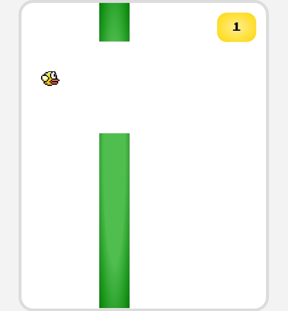
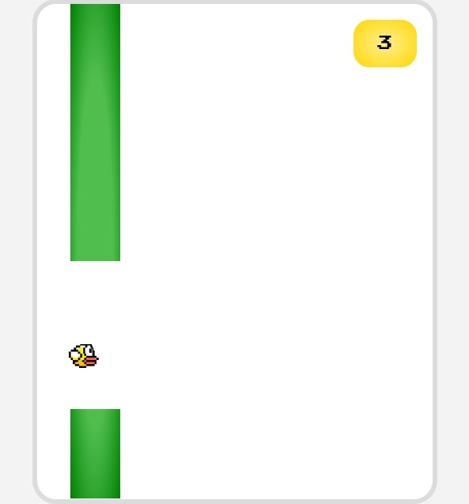
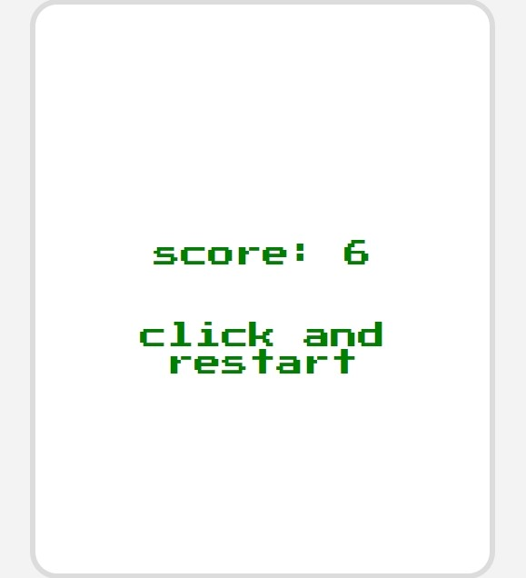

# Flappy Bird
Click and jump. That's a simple logic.\
You must pass from gaps between blocks. And don't lose to gravity! \
Your score will increase after pass every single block. \
If you die, you can restart with click.

Good Luck! 

